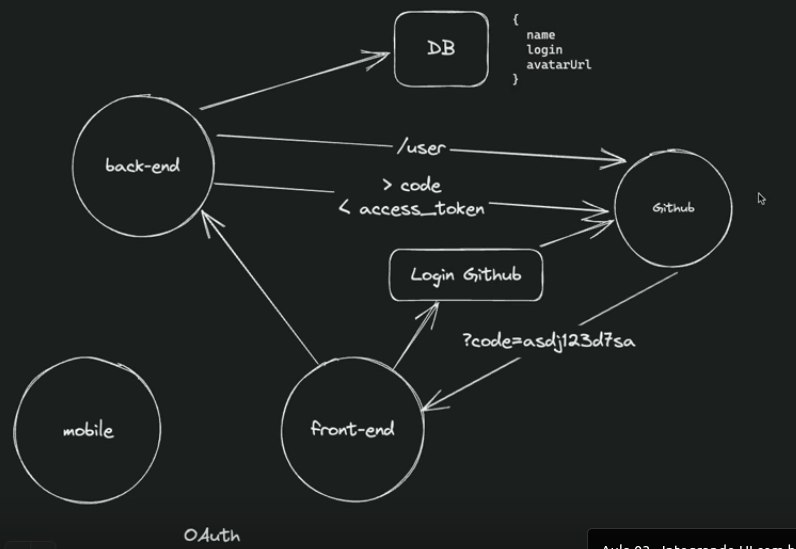

## OAuth

Permite fazer uma autenticação em um sistema usando uma conta existente em outro sistema

<>

Front-end solicita login na plataforma terceira (nesse exemplo github mas serve pra gmail, appleId, facebook etc)

Github devolve um código do usuário

Front-end repassa esse código pro back-end

Back-end re-envia esse código pro Github confirmando o usuário

Github valida se o código está de acordo com aquele usuário e devolve um access token

Access Token é usado para obter dados dos usuários no Github

Dados obtidos pelo back-end são escritos no banco de dados

## CORS

Cross-origin Resource Sharing. Permite que a aplicação back-end especifique quais origens (domínios, portas e protocolos) possuem permissão para acessar as rotas do back-end

## Prisma

Um ORM moderno e seguro, que integra diversos banco de dados diferentes (SQLite, PostgresQL, MongoDB, MySQL).

## Zod

O Zod é uma biblioteca de validação de dados em JavaScript/TypeScript que oferece uma maneira fácil e robusta de validar e manipular dados. Com o Zod, é possível definir esquemas de validação para diferentes tipos de dados, como strings, números, datas, objetos e muito mais. Esses esquemas podem especificar regras como comprimento mínimo/máximo, valores permitidos, formatos de dados específicos e validações personalizadas. Uma das principais vantagens do Zod é a sua forte tipagem e suporte nativo para TypeScript.

## DotEnv (Dependency)

Uma dependência que permita ler as variáveis de ambiente salvas no .env

## Axios

Usado para fazer requisições HTTP. Por mais que exista a fetch API ativa do Node, o Axios é uma biblioteca leve com tratamento de erros mais robusto

## Autenticação JWT

JSON Web Token - Identificar um usuário logado

## Fastify/multipart

Usado para o upload de imagem nas rotas de upload. Dessa forma evita-se que se use um arquivo em base-64, o que apesar de deixar o código mais simples deixaria a imagem mais pesada e não-otimizada.

## Feature de steaming do Node.JS

Sistema do note para escrever um arquivo em partes. O pipeline permite aguardar e verificar o processo de upload finalizar. Após isso, ele transformará a função de pipeline numa promise usando o promisify.